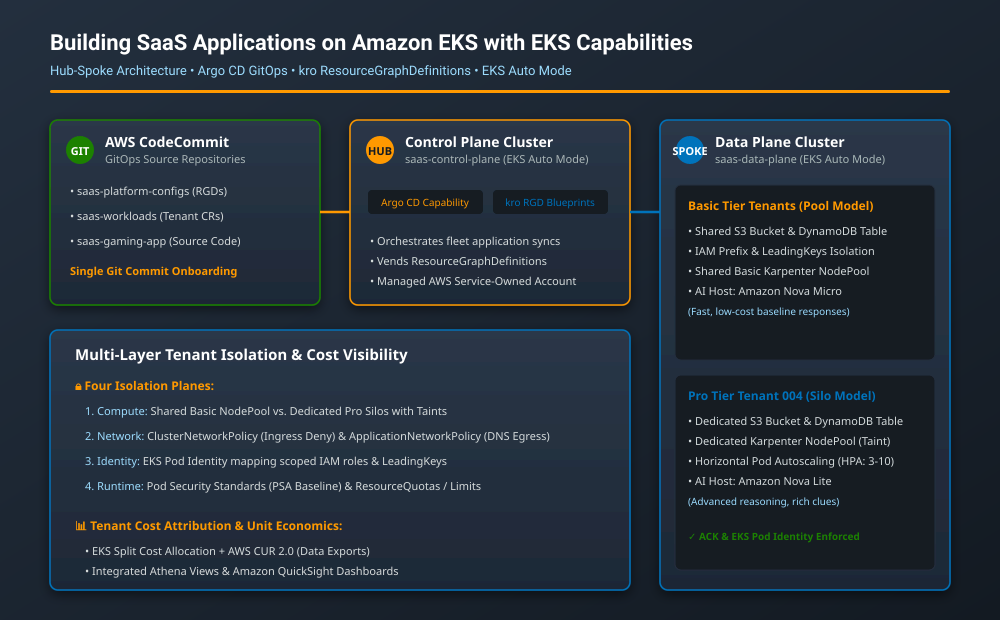
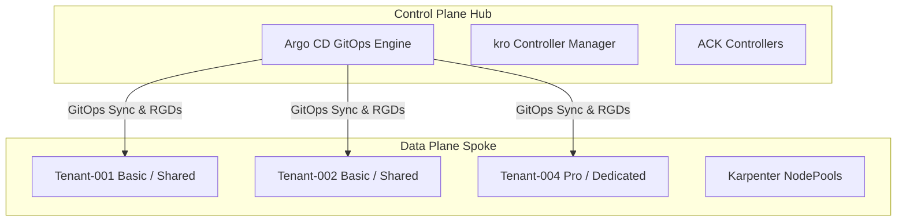
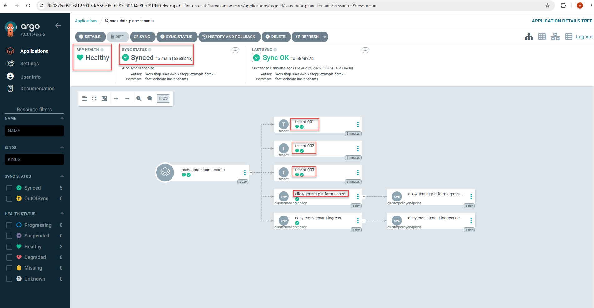
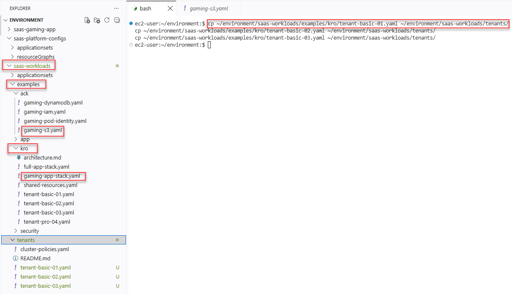
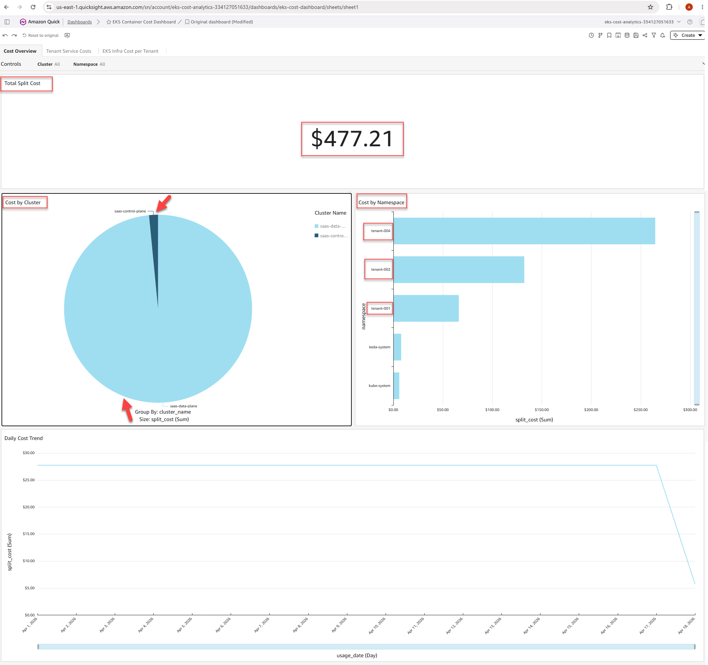

# 🚀 Enterprise Multi-Tenant SaaS Platform on Amazon EKS

<p align="center">
  
  
  
  
</p>

A production-grade, enterprise-ready reference implementation for building, securing, and scaling multi-tenant SaaS platforms on **Amazon Elastic Kubernetes Service (Amazon EKS)**. This architecture leverages **EKS Auto Mode**, **kro (Kubernetes Resource Orchestrator)**, **ACK (AWS Controllers for Kubernetes)**, and **Argo CD GitOps** workflows.

---

## 📊 Enterprise Architecture Overview



The following diagram illustrates the hub-spoke control plane and data plane topology, separating core cluster management from tenant-isolated workloads:


---

## 🔐 Architecture & Identity Flow

The platform implements strict multi-tenant isolation and secure identity propagation across the hub-spoke clusters:

* **Authentication & Access Control**: Administrative and user access is secured via AWS IAM Identity Center integration, mapping roles directly to Kubernetes RBAC groups within both clusters.
* **IRSA (IAM Roles for Service Accounts)**: Workloads assume scoped AWS IAM roles securely without storing long-term credentials inside pods, enforcing least-privilege boundaries for S3 and DynamoDB.
* **GitOps Sync Flow**: The Control Plane Hub (running Argo CD and `kro`) securely communicates with AWS CodeCommit repositories to reconcile and vend custom ResourceGraphDefinitions (RGDs) down to the Data Plane Spoke.
---

## 📋 Prerequisites
Before deploying or validating this repository, ensure your local environment has the following tools installed and configured:
* **AWS CLI** (v2.x configured with appropriate IAM credentials and administrative permissions)
* **kubectl** (v1.30+) for interacting with Amazon EKS control and data plane clusters
* **Git** for repository management and version control
* **Terraform** (v1.5+) for infrastructure provisioning
* **Helm** (v3.x) for chart dependency management

---

### 🏗️ Lab Architecture & Visual Reference 

| Module / Topic | Technical Component | Lab Screenshot Reference & Key Highlights |
| :--- | :--- | :--- |
| **1. Hub-Spoke Foundation** | Control Plane Hub & Data Plane Spoke | **Argo CD Dashboard**:   |
| **2. Blueprint Orchestration** | kro ResourceGraphDefinitions (RGDs) | **VS Code Explorer**:  |
| **3. Cost Attribution** | EKS Split Cost Allocation & QuickSight | **QuickSight Dashboard**:  |

---

### ⚙️ Step-by-Step Execution Instructions

### Phase 1: Environment Setup & Cluster Context Verification
1. **Verify AWS Identity & Configuration:**
```Bash
aws sts get-caller-identity
```
2. **Configure Cluster Context**  
Target your data plane cluster to execute workload configurations:
```Bash
kubectl config use-context data-plane
kubectl config get-contexts
```

### Phase 2: Provision Tenant Workloads via kro
1. **Inspect Available Tenant Blueprints:**  
Navigate into the workload templates directory:
```Bash
cd ~/environment/saas-workloads/examples/kro/
```
2. **Provision Tenant Workloads:**  
Copy example tenant manifests into your active deployment path to trigger automated GitOps reconciliation:
```Bash
cp ~/environment/saas-workloads/examples/kro/tenant-basic-01.yaml ~/environment/saas-workloads/tenants/
cp ~/environment/saas-workloads/examples/kro/tenant-basic-02.yaml ~/environment/saas-workloads/tenants/
cp ~/environment/saas-workloads/examples/kro/tenant-basic-03.yaml ~/environment/saas-workloads/tenants/
 ```
3. **Verify GitOps Reconciliation:**  
   Confirm that Argo CD and kro have successfully provisioned the tenant namespaces and resources:
```Bash
kubectl get tenants -A
kubectl get pods -n tenant-001
```

### Phase 3: Validating Security Guardrails
1. **Test Pod Security Admission (PSA Baseline):**  
Verify that the cluster strictly rejects unauthorized privileged container configurations at admission time:
```Bash
kubectl apply -f saas-workloads/examples/security/privileged-pod.yaml -n tenant-001
```
*Expected Output:  `pods "privileged-demo" is forbidden: violates PodSecurity "baseline:latest": privileged...`*

---

## 🧹 Cleanup Instructions
To completely tear down the environment and avoid ongoing cloud costs, execute the following sequence:

1. **Delete Active Tenant Workloads:**
```Bash
kubectl delete -f saas-workloads/tenants/ --ignore-not-found=true
```

2. **Destroy Provisioned Infrastructure via Terraform:**
```Bash
cd terraform/
terraform destroy -auto-approve
```

3. **Purge Argo CD Applications:**  
   Remove any remaining custom resource definitions and application sync controllers from the control plane hub cluster.
  
---

## 🔗 References & External Web Links

* [Amazon EKS Documentation](https://docs.aws.amazon.com/eks/)
* [Kubernetes Resource Orchestrator (kro)](https://kro.run/)
* [Argo CD - Declarative GitOps CD for Kubernetes](https://argo-cd.readthedocs.io/)
* [AWS Controllers for Kubernetes (ACK)](https://aws-controllers-k8s.github.io/community/)
* [Karpenter Kubernetes Autoscaler](https://karpenter.sh/)
